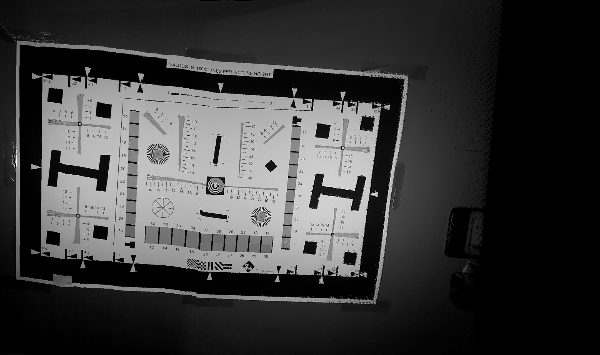
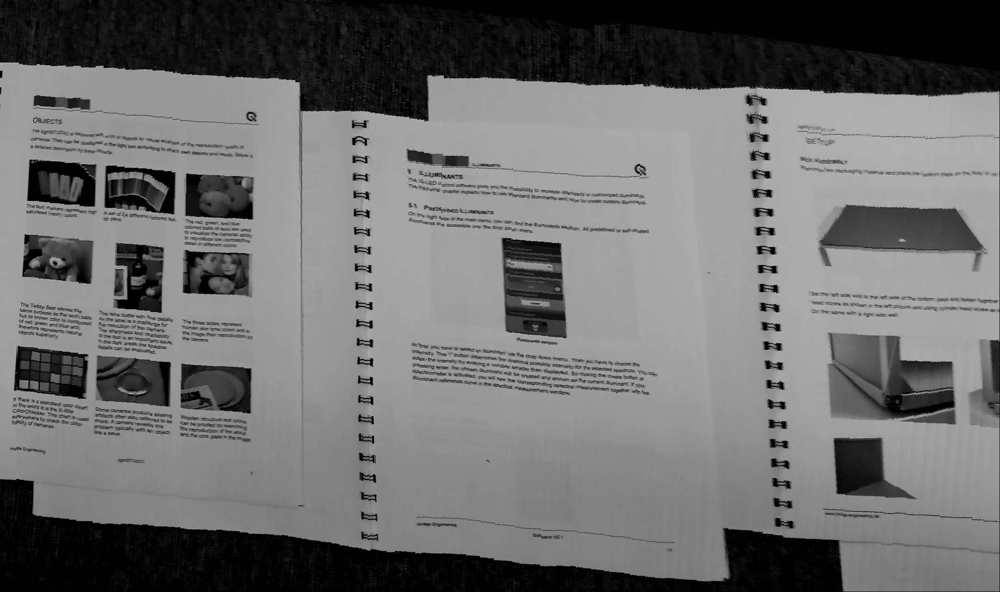

# Stitching A Panorama from Video in Python 

A simiple panorama project, which take a video as input and output a panorama image.

### Requirements:

    -Anaconda > 5.0 
    -Opencv > 3.1   

### some not that basic functions being called from 3rd Lib

    -scipy.ndimage.filters.gaussian_filter
    -numpy.argsort
    -numpy.linalg.eig
    -cv2.VideoCapture
    -cv2.read
    -cv2.cvtColor
    -cv2.flip

### Output

 
<caption> A Chart </caption>
  
 
<caption> Books </caption>
  

### References

    [1] A. Adams, N. Gelfand, and K. Pulli. Viewfinder alignment.Computer Graphics Forum, 27(2):597–606, 2008.
    [2] Kari Pulli, Marius Tico, Yingen Xiong. Mobile Panoramic Imaging System. DOI: 10.1109/CVPRW.2010.5543792
